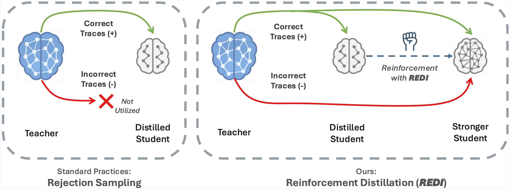

<div align="center">

# Reinforcement Distillation

<div>
Harnessing Negative Signals:

**Reinforcement Distillation** from Teacher Data for LLM Reasoning
</div>
</div>
<div>

<div align="center">

[](full_paper.pdf)
[](https://github.com/Tim-Siu/reinforcement-distillation)
[](https://shuyaoxu.notion.site/redi)
</div>

<div align="center">

</div>

## Overview
Recent advances in model distillation demonstrate that data from advanced reasoning models (e.g., DeepSeek-R1, OpenAI's o1) can effectively transfer complex reasoning abilities to smaller, efficient student models. However, standard practices employ rejection sampling, discarding incorrect reasoning examples---valuable, yet often underutilized data. This paper addresses the critical question: 

*How can both positive and negative distilled reasoning traces be effectively leveraged to maximize LLM reasoning performance in an offline setting?*

 To this end, We propose **Re**inforcement **Di**stillation (**REDI**), a two-stage framework. Checkout our [paper](full_paper.pdf) for details on our methods.

 Notably, the **Qwen-REDI-1.5B** model, post-trained on just 131k positive and negative examples from the open Open-R1 dataset, achieves an 83.1% score on MATH-500 (pass@1). Its performance matches or surpasses that of DeepSeek-R1-Distill-Qwen-1.5 (a model post-trained on 800k proprietary data) across various mathematical reasoning benchmarks, establishing a **new state-of-the-art for 1.5B models post-trained offline with openly available data**.

## Evaluation Results

**Model Performance Comparison (pass@1 over 16 samples) across reasoning benchmarks.** ^*Officially reported pass@1 results. Results for `Qwen2.5-Math-1.5B` are from [EMPO](https://arxiv.org/html/2504.05812v1).

| Model                               | MATH-500        | AIME24          | AMC23           | Minerva         | OlympiadBench   | Avg.            |
| :---------------------------------- | :-------------: | :-------------: | :-------------: | :-------------: | :-------------: | :-------------: |
| `Qwen2.5-Math-1.5B (Base)`                 | 52.2            | 10.0            | 42.5            | 10.7            | 25.2            | 28.1            |
| `Qwen-SFT-1.5B-5ep (SFT)`  | 80.4       | 21.9       | 57.5       | 27.5       | 41.5       | 45.8       |
| **`Qwen-REDI-1.5B (Ours)`**                | 83.1       | 28.1       | **62.4**   | 28.8       | **45.2**   | **49.5**   |
| ---                                 | ---             | ---             | ---             | ---             | ---             | ---             |
| `Qwen2.5-Math-1.5B-Instruct`^*      | 75.8            | 10.0            | 60.0            | **29.4**        | 38.1            | 42.7            |
| `DeepSeek-R1-Distill-Qwen-1.5B`     | **83.2**   | **28.3**   | 62.1       | 26.0       | 43.1       | 48.6       |


## News
- **[2025/05/31]** Our paper is out! Check it out on [arXiv](full_paper.pdf).
- **[2025/04/30]** ⬆️ An In-Depth Blog Post on our [Training Recipe and Insights](https://shuyaoxu.notion.site/redi)
- **[2025/04/30]** REDI codebase is released. Try it out!

## Getting Started

### Installation
You can install REDI dependencies by running the following commands:

```bash
uv venv redi_env --python 3.11 && source redi_env/bin/activate && uv pip install --upgrade pip

# Install vllm and flash-attn
uv pip install vllm==0.7.2
uv pip install matplotlib seaborn
uv pip install setuptools && uv pip install flash-attn --no-build-isolation

cd openr1
GIT_LFS_SKIP_SMUDGE=1 uv pip install -e ".[dev]"

huggingface-cli login
wandb login
```

```bash
# Install trl from source
cd trl
uv pip install -e .
```

---
### Data preprocessing

Make sure you have `OpenR1-Math-Raw` downloaded in `experiments_trl/hf_datasets`. You can download the dataset with

```
git lfs install

git clone https://huggingface.co/datasets/open-r1/OpenR1-Math-Raw
```

To prepare REDI Positives and REDI Pairs:

```bash
cd experiments_trl

# clean the REDI positive data (77629 entries, subset of OpenR1 raw)
python data_preprocess/clean_base_shuffled.py

# To curate the data for positive/negative pairs (53175 queries, used in our methods and DPO)
python data_preprocess/clean_base_shuffled_dpo.py

# To filter out data beyond our defined length limits
python data_preprocess/study_length_distribution.py
```

---

### Training Script


To start running experiments on Qwen/Qwen2.5-Math-1.5B, make sure you **modify** the config:

```json
{
  "max_position_embeddings": 32768,
  "rope_theta": 300000.0
}
```

Train on the REDI Postives for 5 epochs:

```bash
cd experiments_trl/
bash recipes/sft/sft_landmv_5ep/train.sh
bash recipes/sft/sft_landmv_5ep/eval.sh
```

Learn **negative** samples with our proposed reinforcement distillation and REDI Pairs for 1 epoch:

```bash
bash recipes/redi/redi_1_08_1e-6/train.sh
bash recipes/redi/redi_1_08_1e-6/eval.sh
```

## Evaluation

For comparison with other methods, we use DeepScalerR for evaluation and will be releasing evaluation code very soon. Stay tuned!


## Acknowledgements

We thank **Hugging Face** for the Open R1 dataset and libraries like `transformers` and `trl`. We thank the **Qwen** and **DeepSeek** teams for their open-source base models. We appreciate the **DeepScaleR** project for its evaluation framework. Finally, we thank the broader **open-source AI community** for their invaluable tools and collaborative spirit.

## Citation

If you find REDI useful in your research, please consider citing our work using the following BibTeX entry:

```bibtex
@misc{xu2025redi,
  author       = {Xu, Shuyao and Peng, Cheng and Long, Jiangxuan and Xu, Weidi},
  title        = {Reinforcement Distillation: Learning from Off-policy Negative Data},
  year         = {2025},
  month        = {April},
  howpublished = {Blog Post / Technical Report},
  url          = {https://shuyaoxu.notion.site/redi},
  note         = {Code available at \url{https://github.com/Tim-Siu/reinforcement-distillation}}
}
```