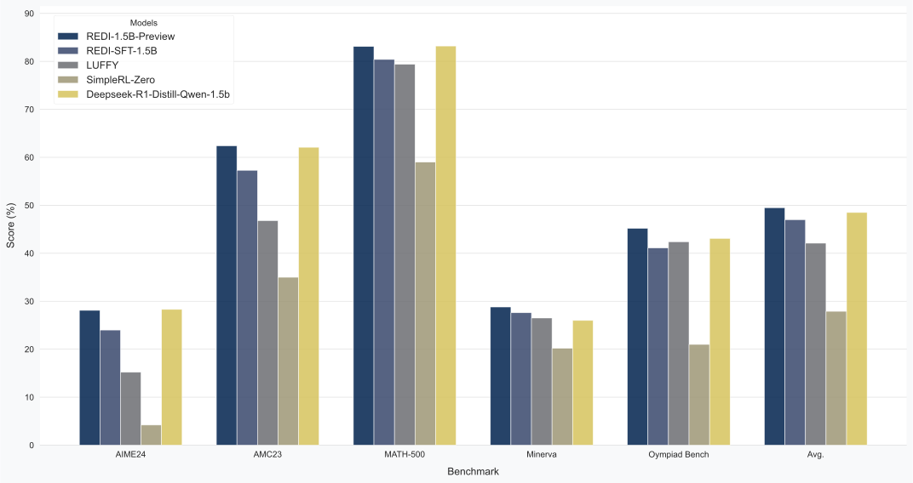

<div align="center">

# Reinforcement Distillation

<div>
Learning from Off-policy Negative Data 🌟
</div>
</div>
<div>
<br>

<div align="center">

[](https://github.com/Tim-Siu/reinforcement-distillation)
[](https://shuyaoxu.notion.site/redi)

</div>

</div>

## Overview
We propose **Reinforcement Distillation (REDI)**, an efficient approach for large language models (LLMs) post-training using offline RL and distilled data. Our **`REDI-1.5B-Preview`** model, fine-tuned from **`Qwen2.5-Math-1.5B`** using a curated 78k subset of the OpenR1 dataset (leveraging both positive and negative examples), achieves **83.1% on MATH-500 (pass@1)**. It performs comparably to or better than DeepSeek-R1-Distill-Qwen-1.5B on several math benchmarks, establishing a new state-of-the-art for 1.5B models fine-tuned offline using openly available distilled data.

A key finding is that **asymmetric weighting** of positive and negative sample gradients during optimization significantly enhances training stability and performance, allowing us to surpass DPO/SimPO without KL regularization.


<div align="center">


<sub>*For more details, see our [blog post](https://shuyaoxu.notion.site/redi).*</sub>
</div>


## News
- **[2025/04/30]** ⬆️ An In-Depth Blog Post on our [Training Recipe and Insights](https://shuyaoxu.notion.site/redi)
- **[2025/04/30]** REDI codebase is released. Try it out!

## Getting Started

### Installation
You can install REDI dependencies by running the following commands:

```bash
cd openr1
# Create virtual environment, activate it, and upgrade pip
uv venv openr1 --python 3.11 && source openr1/bin/activate && uv pip install --upgrade pip

# Install vllm and flash-attn
uv pip install vllm==0.7.2
uv pip install matplotlib seaborn
uv pip install setuptools && uv pip install flash-attn --no-build-isolation

huggingface-cli login
wandb login
```

```bash
# Install trl from source
cd trl
uv pip install -e .
```

---
### Data preprocessing

Make sure you have `OpenR1-Math-Raw` downloaded in `experiments_trl/hf_datasets`. You can download the dataset with

```
git lfs install

git clone https://huggingface.co/datasets/open-r1/OpenR1-Math-Raw
```

To prepare REDI Positives and REDI Pairs:

```bash
cd experiments_trl

# clean the REDI positive data (77629 entries, subset of OpenR1 raw)
python data_preprocess/clean_base_shuffled.py

# To curate the data for positive/negative pairs (53175 queries, used in our methods and DPO)
python data_preprocess/clean_base_shuffled_dpo.py

# To filter out data beyond our defined length limits
python data_preprocess/study_length_distribution.py
```

---

### Training Script


To start running experiments on Qwen/Qwen2.5-Math-1.5B, make sure you **modify** the config:

```json
{
  "max_position_embeddings": 32768,
  "rope_theta": 300000.0
}
```

Train on the REDI Postives for 5 epochs:

```bash
cd experiments_trl/
bash recipes/sft/sft_landmv_5ep/train.sh
bash recipes/sft/sft_landmv_5ep/eval.sh
```

Learn **negative** samples with our proposed reinforcement distillation and REDI Pairs for 1 epoch:

```bash
bash recipes/redi/redi_1_08_1e-6/train.sh
bash recipes/redi/redi_1_08_1e-6/eval.sh
```

## Evaluation

For comparison with other methods, we use DeepScalerR for evaluation and will be releasing evaluation code very soon. Stay tuned!

| Model             | AIME24 | AMC23 | MATH500 | Minerva | Olympiad Bench | Avg. |
|-------------------|------|-------|--------|------------|----------------|------|
| Deepseek-R1-Distill-Qwen-1.5b | 28.3 | 62.1  | 83.2   | 26.0       | 43.1           | 48.5 |
| SimpleRL-Zero     | 4.2  | 35.0  | 59.0   | 20.2       | 21.0           | 27.9 |
| LUFFY             | 15.2 | 46.8  | 79.4   | 26.5       | 42.4           | 42.1 |
| REDI-SFT-1.5B      | 24.0 | 57.3  | 80.4   | 27.6       | 41.1           | 47.0 |
| REDI-1.5B-Preview  | 28.1 | 62.4  | 83.1   | 28.8       | 45.2           | 49.5 |

## Acknowledgements

We thank **Hugging Face** for the Open R1 dataset and libraries like `transformers` and `trl`. We thank the **Qwen** and **DeepSeek** teams for their open-source base models. We appreciate the **DeepScaleR** project for its evaluation framework. Finally, we thank the broader **open-source AI community** for their invaluable tools and collaborative spirit.

## Citation

If you find REDI useful in your research, please consider citing our work using the following BibTeX entry:

```bibtex
@misc{xu2025redi,
  author       = {Xu, Shuyao and Peng, Cheng and Long, Jiangxuan and Xu, Weidi},
  title        = {Reinforcement Distillation: Learning from Off-policy Negative Data},
  year         = {2025},
  month        = {April},
  howpublished = {Blog Post / Technical Report},
  url          = {https://shuyaoxu.notion.site/redi},
  note         = {Code available at \url{https://github.com/Tim-Siu/reinforcement-distillation}}
}
```